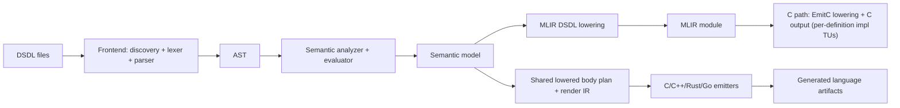

# llvm-dsdl Design

## 1. Program Design

### 1.1 Goals

`llvm-dsdl` is designed to be a strict, reproducible DSDL compiler with:

- Spec-first frontend behavior (strict by default).
- A typed semantic model that can support multiple backends.
- An LLVM/MLIR foundation for long-term compiler evolution.
- Multi-language code generation with shared wire semantics.

The project currently supports:

- C (`dsdlc c`)
- C++23 (`dsdlc cpp`, with `std` and `pmr` profiles)
- Rust (`dsdlc rust`, with `std` and `no-std-alloc` profiles)
- Go (`dsdlc go`)

for the `uavcan` namespace under regulated data types.

### 1.2 High-Level Architecture

### 1.3 Pipeline Stages

#### Frontend

The frontend discovers `.dsdl` files, validates namespace and version/file naming
conventions, tokenizes/parses, and builds AST with source locations.

Primary modules:

- `include/llvmdsdl/Frontend/*`
- `lib/Frontend/*`

#### Semantics

Semantic analysis resolves type references, constants, directives, array bounds,
union constraints, and bit-length/extent information. This stage produces a typed,
resolved `SemanticModule` used by code generators.

Primary modules:

- `include/llvmdsdl/Semantics/*`
- `lib/Semantics/*`

#### IR / MLIR

The project defines a custom DSDL MLIR dialect and lowering hooks. This creates a
compiler-grade intermediate representation suitable for validation/transforms and
future target backends.

Primary modules:

- `include/llvmdsdl/IR/*`
- `lib/IR/*`
- `lib/Lowering/*`
- `lib/Transforms/*`

#### Code Generation

Current generators are in `lib/CodeGen`:

- `CEmitter.cpp`
  - Emits per-type C headers and runtime header.
  - Emits per-definition C implementation translation units through EmitC lowering.
- `CppEmitter.cpp`
  - Emits namespace-based C++23 headers.
  - Supports `std` and `pmr` profiles.
- `RustEmitter.cpp`
  - Emits crate/module layout and Rust SerDes/runtime integration.
- `GoEmitter.cpp`
  - Emits module/package layout and Go SerDes/runtime integration.

Shared generator-side convergence modules include:

- `MlirLoweredFacts*`
- `LoweredBodyPlan*`
- `LoweredRenderIR*`
- helper/statement/binding planners in `lib/CodeGen/*Plan*` and `*Resolver*`

#### Runtime Layer

Runtime helpers encapsulate wire-level bit operations and numeric conversions:

- `runtime/dsdl_runtime.h` (C core)
- `runtime/cpp/dsdl_runtime.hpp` (C++ wrapper)
- `runtime/rust/dsdl_runtime.rs` (Rust runtime)
- `runtime/go/dsdl_runtime.go` (Go runtime)

### 1.4 Tooling and Validation

- `dsdlc` is the main CLI frontend/driver.
- `dsdl-opt` supports MLIR pass experimentation.
- Integration tests verify strict full-tree generation and compile checks.
- CMake workflow presets provide reproducible configure/build/test automation.

---

## 2. Comparison: LLVM vs Nunavut+pydsdl vs Native Non-LLVM

This section compares three implementation approaches:

1. **llvm-dsdl (LLVM/MLIR-based)**  
2. **pydsdl + nunavut (Python reference ecosystem)**  
3. **Native non-LLVM implementation (hypothetical C++ implementation without MLIR/LLVM)**

### 2.1 Feature Matrix

| Capability | llvm-dsdl (LLVM/MLIR) | pydsdl + nunavut | Native Non-LLVM (hypothetical) |
|---|---|---|---|
| Core language/runtime implementation | C++ | Python (+ templates) | C++ |
| DSDL parser + semantics | Yes | Yes (mature reference behavior) | Yes (must build from scratch) |
| Canonical compiler IR | Yes (custom MLIR dialect) | No compiler IR layer | Optional custom IR (must design/maintain) |
| Pass manager and rewrite infra | Yes (MLIR passes/patterns) | No | Must implement custom pass infra |
| Built-in verifier hooks | Yes (dialect/op verifiers) | Limited (library-level checks) | Must implement custom verifier framework |
| Optimization framework | Yes (MLIR + LLVM ecosystem) | Minimal | Custom optimizer required |
| Multi-target codegen scaling | Strong long-term fit | Template-dependent and target-specific | Medium; backend-specific effort |
| Debug/inspection infrastructure | Strong (IR dump/pass pipelines) | Python-level debugging | Custom tooling required |
| Build/dependency complexity | High | Low/medium | Medium |
| Startup and iteration speed | Fast runtime binaries, slower compile/build | Fast scripting iteration | Medium |
| Ecosystem interoperability | Excellent with compiler/toolchain stack | Excellent with existing OpenCyphal workflows | Depends on design |
| Best fit | Long-term compiler platform | Proven generator stack and quick adoption | Lightweight custom stack |

### 2.2 What LLVM/MLIR Is Doing for Us Here

In this project, LLVM/MLIR provides:

- A **structured intermediate representation** for DSDL concepts.
- **Pass composition** for transformation, canonicalization, and validation.
- A path to **incremental lowering** from DSDL-level semantics to target-level code.
- Existing conversion/translation infrastructure (e.g., EmitC path for C impl output).
- Better long-term maintainability for advanced compiler features than ad-hoc
  backend-specific code paths.

Without LLVM, the project would need to build and maintain its own:

- IR and verifier system.
- Pass manager and transformation pipeline.
- Canonicalization/rewrite engine.
- Lowering framework for multiple backends.

### 2.3 Trade-Off Summary

#### llvm-dsdl (LLVM/MLIR)

Pros:

- Compiler-grade architecture with strong extensibility.
- Better fit for multiple language backends and deeper optimization.
- Strong validation and transformation model.

Cons:

- More complexity (build, dependencies, contributor onboarding).
- Higher initial implementation cost.

#### pydsdl + nunavut

Pros:

- Mature, field-proven ecosystem in OpenCyphal workflows.
- Very fast to get started.
- Strong compatibility expectations for existing users.

Cons:

- Not centered around compiler IR/passes.
- Harder to evolve into advanced optimization/transformation architecture.

#### Native Non-LLVM C++ (No MLIR)

Pros:

- Simpler dependency profile than LLVM.
- Potentially easier to keep minimal at small scope.

Cons:

- Significant custom infrastructure burden for anything beyond basic generation.
- Long-term scaling cost for multi-language + optimization + analysis features.

---

## 3. Future Expansion Enabled by LLVM/MLIR

Because the project uses LLVM/MLIR, future work can go beyond “template-based
codegen” into full compiler capabilities.

### 3.1 Near-Term Opportunities

- Move all language backends toward a shared MLIR-driven serialization plan.
- Add stronger IR verifiers for union/extent/array correctness invariants.
- Add target-specific lowering passes (C++/Rust) from common plan ops.
- Improve diagnostics with IR-level provenance and source mapping.

### 3.2 Mid-Term Opportunities

- Backend optimization passes:
  - dead-field elimination for constant/default paths,
  - loop simplification for fixed-size arrays,
  - inlining/specialization for nested composites.
- Alternate runtime strategies generated from profile-aware lowering
  (freestanding, PMR, `no_std + alloc`, etc.).
- Cross-language consistency checks from one canonical IR.

### 3.3 Long-Term Opportunities

- Additional target languages (e.g., Rust `no_std`, C++, Zig, others) from shared IR.
- Static analysis and linting passes directly on DSDL IR.
- Formal conformance tools using IR-level property checks.
- Advanced tooling (`dsdl-opt` pipelines, IR debugging, regression reduction).
- Optional lowerings to other MLIR/LLVM dialects for specialized environments.

---

## 4. Current State vs Target State

Current:

- Frontend + semantics are shared and mature enough for full `uavcan` generation.
- C++/Rust generation is implemented and tested for strict tree generation.
- Go generation is implemented and tested for strict tree generation.
- C path already has an EmitC lowering route for implementation translation units.
- Current implementation emits one `.c` translation unit per DSDL definition
  (monolithic TU-only mode has been removed).
- Go backend verification includes generation, determinism, module build, runtime
  unit tests, and C/Go differential parity workflows.
- Lowered SerDes contract versioning/producer checks are enforced between
  `lower-dsdl-serialization` and `convert-dsdl-to-emitc`.
- Shared lowered-fact collection drives backend wire-semantics decisions for
  C++ (`std`/`pmr`), Rust (`std`), and Go.
- Shared language-agnostic render-IR (`LoweredRenderIR`) now drives core
  per-section body step traversal (`field`, `padding`, `union-dispatch`) in
  C++, Rust, and Go emitters.
- `dsdlc` and `dsdl-opt` support optional optimization on lowered SerDes IR via:
  - CLI flag `--optimize-lowered-serdes`
  - MLIR pass pipeline `optimize-dsdl-lowered-serdes`
- Optimization-enabled parity gates are now part of integration coverage across:
  - signed-narrow C/C++, C/Rust, C/Go,
  - full `uavcan` C/C++, C/Rust, C/Go,
  - differential parity.
- Rust `no-std-alloc` profile is now generation- and compile-checked, with
  dedicated `rust-no-std` integration labels/workflows and C/Rust parity gates
  validating that profile changes do not alter wire behavior.
- Rust runtime specialization is now configurable (`--rust-runtime-specialization`
  `portable|fast`), with dedicated `rust-runtime-specialization` integration
  labels/workflows, C/Rust parity gates, and semantic-diff gates ensuring
  generated type semantics do not drift.
- TypeScript generation (`dsdlc ts`) is now a first-class non-C-like target
  track with lowered-schema validation, shared lowered render-order planning,
  generated runtime support (`dsdl_runtime.ts`), and runtime-backed per-type
  SerDes entrypoints across core semantic families.
- TypeScript integration coverage includes full-`uavcan` generation/determinism/
  typecheck/consumer-smoke/index-contract/runtime-execution gates
  (`llvmdsdl-uavcan-ts-generation`,
  `llvmdsdl-uavcan-ts-determinism`,
  `llvmdsdl-uavcan-ts-typecheck`,
  `llvmdsdl-uavcan-ts-consumer-smoke`,
  `llvmdsdl-uavcan-ts-index-contract`,
  `llvmdsdl-uavcan-ts-runtime-execution-smoke`), fallback-signature hardening
  (`llvmdsdl-fixtures-ts-generation-hardening`), invariant-based C<->TS parity
  (`llvmdsdl-c-ts-parity`, `llvmdsdl-signed-narrow-c-ts-parity`, optimized
  variants), and broad runtime/parity fixture lanes.
- TypeScript strict+compat migration coverage is integrated via:
  `llvmdsdl-ts-compat-generation`,
  `llvmdsdl-ts-compat-runtime`, and
  `llvmdsdl-fixtures-c-ts-compat-parity`.

Target trajectory:

- Continue using MLIR-first lowering plus render-IR convergence so backend logic
  remains focused on syntax/runtime binding rather than semantic traversal.
- Keep language/profile APIs stable while strengthening wire-level conformance and
  differential validation.

### 4.1 Intentional Backend-Specific Behavior

At this stage, backend-specific behavior is intentionally limited to:

- Language surface rendering (syntax, naming, file/module layout).
- Runtime API binding (C runtime calls, C++ profile container selection, Rust/Go
  module wiring).
- Target container/profile choices (`std` vs `pmr`, Rust crate/go module naming).

Wire-semantics behavior (scalar normalization, array prefix/validation, union tag
helpers, delimiter checks, capacity checks, section-plan ordering) is expected to
be sourced from lowered MLIR contracts rather than backend-local fallback logic.

### 4.2 Strict vs Compat Semantics

- `--strict` is spec-first mode (default): enforce current Cyphal DSDL
  semantics implemented by this compiler.
- `--compat-mode` is migration mode: compatibility with legacy/non-conformant
  trees that relied on permissive historical behavior (for example malformed
  array-capacity bounds that are clamped/defaulted in compat mode).
- Compat mode must emit deterministic warnings for downgraded diagnostics, and
  the expected migration path is resolving warnings and returning to `--strict`.
