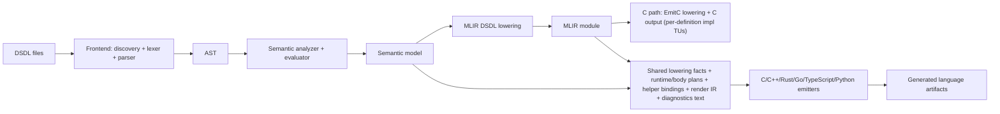
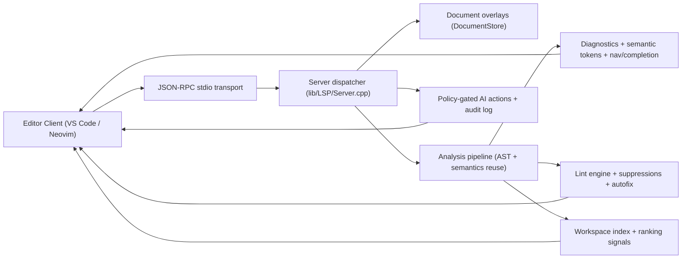

# llvm-dsdl Design

## 1. Program Design

### 1.1 Goals

`llvm-dsdl` is designed to be a reproducible DSDL compiler with:

- Spec-first frontend behavior (single mode).
- A typed semantic model that can support multiple backends.
- An LLVM/MLIR foundation for long-term compiler evolution.
- Multi-language code generation with shared wire semantics.

The project currently supports:

- C (`dsdlc --target-language c`)
- C++23 (`dsdlc --target-language cpp`, with `std` and `pmr` profiles)
- Rust (`dsdlc --target-language rust`, with `std` and `no-std-alloc` profiles, runtime specialization `portable|fast`, and memory modes `max-inline|inline-then-pool`)
- Go (`dsdlc --target-language go`)
- TypeScript (`dsdlc --target-language ts`, with runtime specialization `portable|fast`)
- Python (`dsdlc --target-language python`, with runtime specialization `portable|fast` and backend selection `auto|pure|accel`)

for arbitrary DSDL root namespaces. Full-tree integration validation is currently
centered on the `uavcan` regulated data types.

### 1.2 High-Level Architecture

### 1.3 Pipeline Stages

#### Frontend

The frontend discovers `.dsdl` files, validates namespace and version/file naming
conventions, tokenizes/parses, and builds AST with source locations.

Primary modules:

- `include/llvmdsdl/Frontend/*`
- `lib/Frontend/*`

#### Semantics

Semantic analysis resolves type references, constants, directives, array bounds,
union constraints, and bit-length/extent information. This stage produces a typed,
resolved `SemanticModule` used by code generators.

Primary modules:

- `include/llvmdsdl/Semantics/*`
- `lib/Semantics/*`

#### IR / MLIR

The project defines a custom DSDL MLIR dialect and lowering hooks. This creates a
compiler-grade intermediate representation suitable for validation/transforms and
future target backends.

Primary modules:

- `include/llvmdsdl/IR/*`
- `lib/IR/*`
- `lib/Lowering/*`
- `lib/Transforms/*`

#### Code Generation

Current generators are in `lib/CodeGen`:

All non-C backends consume both the semantic model and MLIR-derived lowering
facts/plans (for wire-semantics ordering/contracts) before rendering
language-specific artifacts.

- `CEmitter.cpp`
  - Emits per-type C headers and runtime header.
  - Emits per-definition C implementation translation units through EmitC lowering.
- `CppEmitter.cpp`
  - Emits namespace-based C++23 headers.
  - Supports `std` and `pmr` profiles.
- `RustEmitter.cpp`
  - Emits crate/module layout and Rust SerDes/runtime integration.
- `GoEmitter.cpp`
  - Emits module/package layout and Go SerDes/runtime integration.
- `TsEmitter.cpp`
  - Emits TypeScript package/module layout and generated runtime-backed SerDes integration.
- `PythonEmitter.cpp`
  - Emits Python package/module layout, generated dataclasses, packaging metadata (`pyproject.toml`, `py.typed`), and runtime-backed SerDes integration.

Shared generator-side convergence modules include:

- `MlirLoweredFacts*`
- `LoweredBodyPlan*`
- `LoweredRenderIR*`
- `NamingPolicy*` (shared keyword/sanitize/case projection policy)
- `ConstantLiteralRender*` (shared literal syntax rendering)
- `StorageTypeTokens*` (shared scalar storage token mapping for C/C++/Rust/Go)
- `DefinitionIndex*` (shared semantic lookup index by lowered key)
- `DefinitionPathProjection*` (shared versioned type/file path projection)
- `DefinitionDependencies*` (shared native-backend composite dependency collection)
- `CompositeImportGraph*` (shared scripted-backend composite import collection/projection)
- `CHeaderRender*` (shared C metadata macro/service wrapper rendering helpers)
- `HelperBindingNaming*` (shared lowered helper-binding identifier projection)
- `LoweredFactsLookup*` (shared lowered section-facts lookup)
- `RuntimeLoweredPlan*` (backend-neutral ordered runtime field/section planning)
- `RuntimeHelperBindings*` (shared lowered helper-symbol lookup/resolution)
- `ScriptedBodyPlan*` (TS/Python scripted section/field helper planning)
- `NativeEmitterTraversal*` (shared lowered-step traversal callbacks for C++/Rust/Go)
- `NativeHelperContract*` (shared section+field helper contract checks for C++/Rust/Go)
- `CodegenDiagnosticText*` (shared cross-backend diagnostic text catalog)
- helper/statement/binding planners in `lib/CodeGen/*Plan*` and `*Resolver*`

Emitter responsibilities are intentionally constrained to:

- language syntax/module/file rendering,
- runtime primitive call wiring, and
- backend-specific API surface mapping.

Wire-semantics orchestration (ordering, helper selection, validation rules, and
diagnostic-text parity) is centralized in the shared planning/binding layers.

#### Runtime Layer

Runtime helpers encapsulate wire-level bit operations and numeric conversions:

- `runtime/dsdl_runtime.h` (C core)
- `runtime/cpp/dsdl_runtime.hpp` (C++ wrapper)
- `runtime/rust/dsdl_runtime.rs` (Rust runtime)
- `runtime/go/dsdl_runtime.go` (Go runtime)
- generated `dsdl_runtime.ts` (TypeScript runtime helper emitted by `dsdlc --target-language ts`)
- generated `_dsdl_runtime.py` + `_runtime_loader.py` (Python runtime helpers emitted by `dsdlc --target-language python`)
- generated `pyproject.toml` + `py.typed` (Python packaging metadata emitted by `dsdlc --target-language python`)

Generated helper bindings sourced from lowered MLIR contracts provide
scalar/array/union/delimiter/capacity semantics in all non-C backends
(C++, Rust, Go, TypeScript, Python); low-level runtime primitives remain
hand-maintained by design.

### 1.4 Tooling and Validation

- `dsdlc` is the main CLI frontend/driver.
- `dsdl-opt` supports MLIR pass experimentation.
- Integration tests verify full-tree generation and compile checks.
- CMake workflow presets provide reproducible configure/build/test automation.

---

## 2. Comparison: LLVM vs Nunavut+pydsdl vs Native Non-LLVM

This section compares three implementation approaches:

1. **llvm-dsdl (LLVM/MLIR-based)**  
2. **pydsdl + nunavut (Python reference ecosystem)**  
3. **Native non-LLVM implementation (hypothetical C++ implementation without MLIR/LLVM)**

### 2.1 Feature Matrix

| Capability | llvm-dsdl (LLVM/MLIR) | pydsdl + nunavut | Native Non-LLVM (hypothetical) |
|---|---|---|---|
| Core language/runtime implementation | C++ | Python (+ templates) | C++ |
| DSDL parser + semantics | Yes | Yes (mature reference behavior) | Yes (must build from scratch) |
| Canonical compiler IR | Yes (custom MLIR dialect) | No compiler IR layer | Optional custom IR (must design/maintain) |
| Pass manager and rewrite infra | Yes (MLIR passes/patterns) | No | Must implement custom pass infra |
| Built-in verifier hooks | Yes (dialect/op verifiers) | Limited (library-level checks) | Must implement custom verifier framework |
| Optimization framework | Yes (MLIR + LLVM ecosystem) | Minimal | Custom optimizer required |
| Multi-target codegen scaling | Strong long-term fit | Template-dependent and target-specific | Medium; backend-specific effort |
| Debug/inspection infrastructure | Strong (IR dump/pass pipelines) | Python-level debugging | Custom tooling required |
| Build/dependency complexity | High | Low/medium | Medium |
| Startup and iteration speed | Fast runtime binaries, slower compile/build | Fast scripting iteration | Medium |
| Ecosystem interoperability | Excellent with compiler/toolchain stack | Excellent with existing OpenCyphal workflows | Depends on design |
| Best fit | Long-term compiler platform | Proven generator stack and quick adoption | Lightweight custom stack |

### 2.2 What LLVM/MLIR Is Doing for Us Here

In this project, LLVM/MLIR provides:

- A **structured intermediate representation** for DSDL concepts.
- **Pass composition** for transformation, canonicalization, and validation.
- A path to **incremental lowering** from DSDL-level semantics to target-level code.
- Existing conversion/translation infrastructure (e.g., EmitC path for C impl output).
- Better long-term maintainability for advanced compiler features than ad-hoc
  backend-specific code paths.

Without LLVM, the project would need to build and maintain its own:

- IR and verifier system.
- Pass manager and transformation pipeline.
- Canonicalization/rewrite engine.
- Lowering framework for multiple backends.

### 2.3 Trade-Off Summary

#### llvm-dsdl (LLVM/MLIR)

Pros:

- Compiler-grade architecture with strong extensibility.
- Better fit for multiple language backends and deeper optimization.
- Strong validation and transformation model.

Cons:

- More complexity (build, dependencies, contributor onboarding).
- Higher initial implementation cost.

#### pydsdl + nunavut

Pros:

- Mature, field-proven ecosystem in OpenCyphal workflows.
- Very fast to get started.
- Strong compatibility expectations for existing users.

Cons:

- Not centered around compiler IR/passes.
- Harder to evolve into advanced optimization/transformation architecture.

#### Native Non-LLVM C++ (No MLIR)

Pros:

- Simpler dependency profile than LLVM.
- Potentially easier to keep minimal at small scope.

Cons:

- Significant custom infrastructure burden for anything beyond basic generation.
- Long-term scaling cost for multi-language + optimization + analysis features.

---

## 3. Future Expansion Enabled by LLVM/MLIR

Because the project uses LLVM/MLIR, future work can go beyond “template-based
codegen” into full compiler capabilities.

### 3.1 Near-Term Opportunities

- Move all language backends toward a shared MLIR-driven serialization plan.
- Add stronger IR verifiers for union/extent/array correctness invariants.
- Add target-specific lowering passes (C++/Rust) from common plan ops.
- Improve diagnostics with IR-level provenance and source mapping.

### 3.2 Mid-Term Opportunities

- Backend optimization passes:
  - dead-field elimination for constant/default paths,
  - loop simplification for fixed-size arrays,
  - inlining/specialization for nested composites.
- Alternate runtime strategies generated from profile-aware lowering
  (freestanding, PMR, `no_std + alloc`, etc.).
- Cross-language consistency checks from one canonical IR.

### 3.3 Long-Term Opportunities

- Additional target languages (e.g., Rust `no_std`, C++, Zig, others) from shared IR.
- Static analysis and linting passes directly on DSDL IR.
- Formal conformance tools using IR-level property checks.
- Advanced tooling (`dsdl-opt` pipelines, IR debugging, regression reduction).
- Optional lowerings to other MLIR/LLVM dialects for specialized environments.

---

## 4. Current State vs Target State

Current:

- Frontend + semantics are shared and mature enough for full `uavcan` generation.
- C++/Rust generation is implemented and tested for full-tree generation.
- Go generation is implemented and tested for full-tree generation.
- C path already has an EmitC lowering route for implementation translation units.
- Current implementation emits one `.c` translation unit per DSDL definition
  (monolithic TU-only mode has been removed).
- Go backend verification includes generation, determinism, module build, runtime
  unit tests, and C/Go differential parity workflows.
- Lowered SerDes contract versioning/producer checks are enforced between
  `lower-dsdl-serialization` and `convert-dsdl-to-emitc`.
- Shared lowered-fact collection drives backend wire-semantics decisions for
  C++ (`std`/`pmr`), Rust (`std`/`no-std-alloc`), Go, TypeScript, and Python.
- Shared runtime/body orchestration now has explicit convergence layers:
  `RuntimeLoweredPlan`, `RuntimeHelperBindings`, `ScriptedBodyPlan`
  (TypeScript/Python), `NativeEmitterTraversal` (C++/Rust/Go), and
  `CodegenDiagnosticText`.
- Shared language-agnostic render-IR (`LoweredRenderIR`) now drives core
  per-section body step traversal (`field`, `padding`, `union-dispatch`) in
  C++, Rust, Go, TypeScript, and Python emitters.
- `dsdlc` and `dsdl-opt` support optional optimization on lowered SerDes IR via:
  - CLI flag `--optimize-lowered-serdes`
  - MLIR pass pipeline `optimize-dsdl-lowered-serdes`
- Optimization-enabled parity gates are now part of integration coverage across:
  - signed-narrow C/C++, C/Rust, C/Go,
  - full `uavcan` C/C++, C/Rust, C/Go,
  - differential parity.
- Rust `no-std-alloc` profile is now generation- and compile-checked, with
  dedicated `rust-no-std` integration labels/workflows and C/Rust parity gates
  validating that profile changes do not alter wire behavior.
- Rust runtime specialization is now configurable (`--rust-runtime-specialization`
  `portable|fast`), with dedicated `rust-runtime-specialization` integration
  labels/workflows, C/Rust parity gates, and semantic-diff gates ensuring
  generated type semantics do not drift.
- Rust memory-mode contract is now explicit through
  `--rust-memory-mode <max-inline|inline-then-pool>` and
  `--rust-inline-threshold-bytes <N>`, with generated `Cargo.toml` metadata
  recording selected profile/specialization/memory-threshold settings.
- Rust runtime foundations now include a `VarArray<T>` container abstraction,
  pool-provider contract types, and fixture-backed runtime unit-test lanes for
  `std` and `no-std-alloc` profiles.
- Rust emitter integration now emits per-field pool class identifiers,
  memory-contract constants, and decode-time pool-aware reserve routes while
  preserving the generated public type API.
- Rust allocation-failure taxonomy is contract-defined for non-std evolution:
  malformed/truncated input errors remain separate from allocation failures, and
  pool-mode allocation failures are surfaced deterministically with type-class
  context in downstream runtime workstreams.
- Rust integration coverage now includes memory-mode specific lanes for:
  - signed-narrow and full-`uavcan` C/Rust differential parity,
  - full-`uavcan` generation + cargo-check in `inline-then-pool` mode,
  - memory-mode semantic-diff checks, and
  - concurrent determinism checks.
- Rust runtime failure-path coverage now includes deterministic tiny-pool OOM and
  invalid-request contract tests, stable error-code mapping checks, and
  non-mutating failure-path invariants for pool-backed reserve routes.
- Rust benchmark coverage now includes an artifact-first runtime memory-mode lane
  that compares generated `max-inline` and `inline-then-pool` crates across
  small/medium/large payload families, with optional threshold gating and
  embedded-profile recommendation output.
- TypeScript generation (`dsdlc --target-language ts`) is now a first-class non-C-like target
  track with lowered-schema validation, shared lowered render-order planning,
  generated runtime support (`dsdl_runtime.ts`), and runtime-backed per-type
  SerDes entrypoints across core semantic families.
- Python generation (`dsdlc --target-language python`) is now a first-class non-C-like target
  track with lowered-schema validation, shared lowered runtime planning,
  generated dataclass-based SerDes entrypoints, and runtime backend selection
  (`auto|pure|accel`) through generated loader/runtime modules.
- TypeScript runtime specialization is now configurable
  (`--ts-runtime-specialization` `portable|fast`), with dedicated
  `ts-runtime-specialization` integration labels/workflows, C<->TS parity
  gates, and semantic-diff gates ensuring generated type semantics remain
  unchanged while runtime helper implementation strategy varies.
- TypeScript integration coverage includes full-`uavcan` generation/determinism/
typecheck/consumer-smoke/index-contract/runtime-execution gates
  (`llvmdsdl-uavcan-ts-generation`,
  `llvmdsdl-uavcan-ts-determinism`,
  `llvmdsdl-uavcan-ts-typecheck`,
  `llvmdsdl-uavcan-ts-consumer-smoke`,
  `llvmdsdl-uavcan-ts-index-contract`,
  `llvmdsdl-uavcan-ts-runtime-execution-smoke`), fallback-signature hardening
  (`llvmdsdl-fixtures-ts-generation-hardening`), invariant-based C<->TS parity
  (`llvmdsdl-c-ts-parity`, `llvmdsdl-signed-narrow-c-ts-parity`, optimized
  variants), and broad runtime/parity fixture lanes.
- Python integration coverage includes fixture-generation hardening, runtime
  smoke (portable/fast + optimized lowering), backend selection behavior
  (`auto|pure|accel`), full-`uavcan` generation/determinism gates, and a
  Python runtime benchmark harness. CMake generation flow also includes
  accelerator staging targets and optional wheel staging targets for generated
  Python packages.

Python validation taxonomy (parity with mature targets):

- Generation and determinism:
  - fixture hardening lane and full-tree `uavcan` generation/determinism lanes.
- Runtime execution:
  - fixture smoke lanes plus full-tree runtime execution lanes
    (`portable`, `fast`, and optimized-lowering variants).
- Differential parity:
  - C<->Python parity families across runtime/service/array/bigint/float/utf8/
    delimited/union/composite/truncated/padding-alignment classes.
  - signed-narrow parity lanes (`portable`, optimized, and `fast` specialization).
- Backend and specialization contracts:
  - backend selector behavior (`auto|pure|accel`) and pure-vs-accel parity.
  - CI-required accelerator gate lanes (`python-accel-required` label) that hard-fail
    if the accelerator module is unavailable or parity/selection behavior regresses.
  - explicit malformed-input contract test lane:
    - portable pure runtime: tolerant zero-extend reads.
    - fast pure runtime: byte-aligned out-of-range extract/copy rejects with `ValueError`.
    - accel runtime: follows accelerator helper behavior (tolerant extract, strict copy range checks).
  - seeded malformed-decode fuzz/property parity lane validating contract-constrained
    subset behavior across `portable`, `fast`, and `accel`.
  - specialization semantic-diff lane validating `portable` vs `fast` runtime
    helper divergence without generated-type semantic drift.
- Performance policy:
  - benchmark lane emits per-family/per-mode reports by default and supports
    optional threshold gating.
  - Rust runtime benchmark lane emits per-family/per-mode encode/decode metrics
    and estimated pool-route allocation-call counts for threshold tuning.

Python runtime troubleshooting matrix:

| Condition | Why it happens | Design-intended behavior |
| --- | --- | --- |
| `accel` mode import failure | accelerator module absent | fail fast in explicit `accel` mode; `auto` falls back to pure |
| `auto` chooses `pure` | accelerator unavailable or not staged | preserve correctness first; performance path is opportunistic |
| specialization mismatch (`portable` vs `fast`) | helper implementation drift | semantic-diff lane catches unintended API/wire drift |
| benchmark threshold failures | host variance or stale thresholds | artifact-first policy allows baseline capture before enforcing gates |

Target trajectory:

- Continue using MLIR-first lowering plus render-IR convergence so backend logic
  remains focused on syntax/runtime binding rather than semantic traversal.
- Keep language/profile APIs stable while strengthening wire-level conformance and
  differential validation.

### 4.1 Intentional Backend-Specific Behavior

At this stage, backend-specific behavior is intentionally limited to:

- Language surface rendering (syntax, naming, file/module layout).
- Runtime API binding (C runtime calls, C++ profile container selection, Rust/Go
  module wiring).
- Target container/profile choices (`std` vs `pmr`, Rust crate/profile/memory-mode
  naming, Go module naming).

Wire-semantics behavior (scalar normalization, array prefix/validation, union tag
helpers, delimiter checks, capacity checks, section-plan ordering) is expected to
be sourced from lowered MLIR contracts rather than backend-local fallback logic.

TypeScript and Python now follow the same helper-binding architecture as
C++/Rust/Go for these semantics; remaining backend-local runtime code in
`runtime/` is intentionally limited to low-level bit/float/buffer primitives.

### 4.2 Frontend Semantics

- `dsdlc` enforces one spec-conformant semantic mode for Cyphal DSDL.
- Non-conformant definitions are rejected with diagnostics; no permissive
  compatibility fallback mode is supported.

---

## 5. LSP Architecture (`dsdld`)

`dsdld` is a first-class tool in this repository and reuses the core compiler
stack rather than maintaining a separate parser/tokenizer implementation.

### 5.1 High-Level LSP Flow

### 5.2 Request/Notification Model

Core request handlers include:

1. `initialize`, `shutdown`
2. `textDocument/semanticTokens/full`
3. `textDocument/hover`
4. `textDocument/definition`
5. `textDocument/references`
6. `textDocument/documentSymbol`
7. `textDocument/completion` and `completionItem/resolve`
8. `textDocument/prepareRename` and `textDocument/rename`
9. `textDocument/codeAction` and `codeAction/resolve`
10. `workspace/symbol`

Core notifications include:

1. `textDocument/didOpen`
2. `textDocument/didChange`
3. `textDocument/didClose`
4. `workspace/didChangeConfiguration`
5. `$/cancelRequest`
6. `exit`

### 5.3 Shared Compiler Reuse

The LSP path intentionally depends on the same codebase used by `dsdlc`:

1. Frontend discovery/lexing/parsing to produce AST.
2. Semantic analysis and evaluator for symbol/type resolution.
3. Common diagnostics model with source locations.

This prevents drift between batch compilation and editor-time behavior.

### 5.4 Indexing And Ranking

`dsdld` builds and maintains a workspace symbol index, with optional cache
persistence and verification/repair workflows.

Supporting docs:

1. `docs/LSP_INDEX_SCHEMA.md`
2. `docs/LSP_RANKING_MODEL.md`

Ranking combines lexical features and adaptive usage signals for both completion
and workspace-symbol queries.

### 5.5 Linting

Linting is deterministic, configurable, and supports:

1. Workspace-level suppression
2. Per-file suppression
3. In-source suppression comments
4. Optional plugin rule packs
5. Autofix quick actions

Lint authoring details are documented in:

1. `docs/LSP_LINT_RULES.md`
2. `docs/LSP_LINT_RULE_AUTHORING.md`

### 5.6 AI Safety Model

AI behavior is optional and policy-gated:

1. Modes: `off`, `suggest`, `assist`, `apply_with_confirmation`
2. Confirmation-gated edit materialization
3. Safe tool allow-list
4. Bounded context packing
5. Redacted audit logging

Operator guidance:

1. `docs/LSP_AI_OPERATOR_GUIDE.md`
