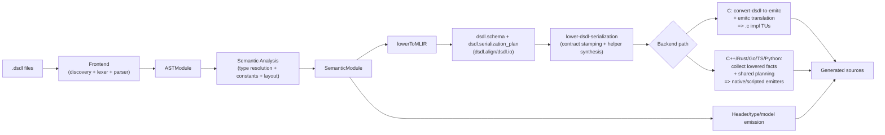

# llvm-dsdl Design

## 1. Purpose

`llvm-dsdl` is a compiler toolchain for [Cyphal DSDL](https://github.com/OpenCyphal/specification/tree/master/specification/dsdl), built to make one semantic interpretation of `.dsdl` definitions reusable across many target languages. DSDL describes message/service data contracts and wire behavior. In practice, this project turns those contracts into language artifacts that can serialize and deserialize bytes consistently.

The project deliberately combines three ideas:

- DSDL as the domain language and source of truth for data contracts.
- LLVM/MLIR as compiler infrastructure for normalized IR and pass-managed transformations.
- Multi-language emitters that share lowered wire-semantics rather than re-implementing rules backend-by-backend.

This repo currently ships three user-facing tools:

- [`dsdlc`](tools/dsdlc/main.cpp): compile/codegen driver.
- [`dsdl-opt`](tools/dsdl-opt/main.cpp): pass-driver over the custom dialect.
- [`dsdld`](tools/dsdld/main.cpp): language server for editor workflows.

Supported `dsdlc --target-language` values today are `ast`, `mlir`, `c`, `cpp`, `rust`, `go`, `ts`, and `python`.

## 2. Realized Architecture

The current architecture is not just a proposal; it is what the build and tests execute now. Frontend parsing and semantic analysis are shared once, lowered to a DSDL-specific MLIR representation, then consumed by backend codegen paths. The C path goes deepest through EmitC conversion; other language backends consume shared lowered contracts/facts and render native or scripted source.

A useful way to read this diagram is: syntax and semantics happen once, wire-layout intent is normalized once, then that normalized intent is reused broadly.

## 3. Layered Modules

### 3.1 Frontend ([`include/llvmdsdl/Frontend`](./include/llvmdsdl/Frontend), [`lib/Frontend`](./lib/Frontend))

The frontend is responsible for discovering definitions, parsing files, and preserving source context for diagnostics. It is intentionally strict about DSDL source structure because every later stage depends on deterministic AST shape and identity metadata.

Key source files:

- [`include/llvmdsdl/Frontend/AST.h`](include/llvmdsdl/Frontend/AST.h)
- [`include/llvmdsdl/Frontend/Parser.h`](include/llvmdsdl/Frontend/Parser.h)
- [`lib/Frontend/Discovery.cpp`](lib/Frontend/Discovery.cpp)
- [`lib/Frontend/Lexer.cpp`](lib/Frontend/Lexer.cpp)
- [`lib/Frontend/Parser.cpp`](lib/Frontend/Parser.cpp)

Primary entry point:

- `parseDefinitions(...) -> ASTModule`

### 3.2 Semantics ([`include/llvmdsdl/Semantics`](./include/llvmdsdl/Semantics), [`lib/Semantics`](./lib/Semantics))

Semantic analysis resolves references, evaluates constants, computes field/section layout properties, and builds the backend-facing `SemanticModule`. This is where the project moves from syntax to meaning. If frontend AST says what the source wrote, semantics says what it means on the wire.

Key source files:

- [`include/llvmdsdl/Semantics/Model.h`](include/llvmdsdl/Semantics/Model.h)
- [`include/llvmdsdl/Semantics/Evaluator.h`](include/llvmdsdl/Semantics/Evaluator.h)
- [`include/llvmdsdl/Semantics/BitLengthSet.h`](include/llvmdsdl/Semantics/BitLengthSet.h)
- [`lib/Semantics/Analyzer.cpp`](lib/Semantics/Analyzer.cpp)

Primary entry point:

- `analyze(...) -> SemanticModule`

### 3.3 IR Dialect ([`include/llvmdsdl/IR`](./include/llvmdsdl/IR), [`lib/IR`](./lib/IR))

The custom `dsdl` dialect is the project’s canonical intermediate boundary. Instead of each backend consuming raw semantic objects directly, this project materializes explicit schema/serialization-plan operations first. That makes transformations inspectable and contract-checkable.

Relevant dialect files:

- [`include/llvmdsdl/IR/DSDLOps.td`](include/llvmdsdl/IR/DSDLOps.td)
- [`include/llvmdsdl/IR/DSDLTypes.td`](include/llvmdsdl/IR/DSDLTypes.td)
- [`include/llvmdsdl/IR/DSDLAttrs.td`](include/llvmdsdl/IR/DSDLAttrs.td)
- [`lib/IR/DSDLOps.cpp`](lib/IR/DSDLOps.cpp)
- [`lib/IR/DSDLDialect.cpp`](lib/IR/DSDLDialect.cpp)

Core ops currently in active use are `dsdl.schema`, `dsdl.field`, `dsdl.constant`, `dsdl.serialization_plan`, `dsdl.align`, and `dsdl.io`.

### 3.4 Semantic-to-MLIR Lowering ([`include/llvmdsdl/Lowering`](./include/llvmdsdl/Lowering), [`lib/Lowering`](./lib/Lowering))

`lowerToMLIR(...)` converts semantic definitions into schema symbols and section plans. It includes enough attributes to describe field category, cast mode, array mode/capacity, alignment, union metadata, and bounded bit-length facts.

Key file:

- [`lib/Lowering/LowerToMLIR.cpp`](lib/Lowering/LowerToMLIR.cpp)

This stage is the bridge where DSDL-specific semantic facts become compiler IR facts that passes can reason about.

### 3.5 MLIR Transforms ([`include/llvmdsdl/Transforms`](./include/llvmdsdl/Transforms), [`lib/Transforms`](./lib/Transforms))

Transforms are where normalization and contract hardening happen. The pass set currently includes:

- `lower-dsdl-serialization`
- `convert-dsdl-to-emitc`
- optional `optimize-dsdl-lowered-serdes` pipeline

Key files:

- [`include/llvmdsdl/Transforms/Passes.h`](include/llvmdsdl/Transforms/Passes.h)
- [`include/llvmdsdl/Transforms/LoweredSerDesContract.h`](include/llvmdsdl/Transforms/LoweredSerDesContract.h)
- [`lib/Transforms/Passes.cpp`](lib/Transforms/Passes.cpp)
- [`lib/Transforms/ConvertDSDLToEmitC.cpp`](lib/Transforms/ConvertDSDLToEmitC.cpp)

The lowered contract attributes are an explicit handshake between producers and consumers. Backends validate contract version/producer and helper availability before rendering code. This is a major reliability property of the current design.

### 3.6 Codegen ([`include/llvmdsdl/CodeGen`](./include/llvmdsdl/CodeGen), [`lib/CodeGen`](./lib/CodeGen))

Code generation is split into backend-specific rendering plus shared convergence layers. All backends receive both semantic and MLIR module inputs. Shared planners/helpers reduce divergence in behavior across languages.

Representative shared layers:

- [`include/llvmdsdl/CodeGen/MlirLoweredFacts.h`](include/llvmdsdl/CodeGen/MlirLoweredFacts.h)
- [`include/llvmdsdl/CodeGen/LoweredRenderIR.h`](include/llvmdsdl/CodeGen/LoweredRenderIR.h)
- [`include/llvmdsdl/CodeGen/RuntimeLoweredPlan.h`](include/llvmdsdl/CodeGen/RuntimeLoweredPlan.h)
- [`include/llvmdsdl/CodeGen/RuntimeHelperBindings.h`](include/llvmdsdl/CodeGen/RuntimeHelperBindings.h)
- [`include/llvmdsdl/CodeGen/NativeEmitterTraversal.h`](include/llvmdsdl/CodeGen/NativeEmitterTraversal.h)
- [`include/llvmdsdl/CodeGen/NativeHelperContract.h`](include/llvmdsdl/CodeGen/NativeHelperContract.h)
- [`include/llvmdsdl/CodeGen/ScriptedOperationPlan.h`](include/llvmdsdl/CodeGen/ScriptedOperationPlan.h)

This structure is the core of the “shared semantics, multiple syntaxes” strategy.

## 4. Backend Architecture (As Implemented)

### 4.1 C backend (`emitC`)

The C backend is currently the most MLIR-native path. For each selected definition, it runs lowering and conversion passes, then translates EmitC IR into C implementation text. The resulting `.c` translation units are paired with generated headers and the C runtime.

Key file:

- [`lib/CodeGen/CEmitter.cpp`](lib/CodeGen/CEmitter.cpp)

Current path:

1. Validate lowered contract coverage.
2. Clone per-definition schema into a working module.
3. Run pass pipeline (`lower-dsdl-serialization`, optional optimize, `convert-dsdl-to-emitc`, canonicalization/CSE, emitc conversions).
4. Emit body using `mlir::emitc::translateToCpp(...)`.
5. Emit matching `.h` API and `dsdl_runtime.h`.

### 4.2 C++ backend (`emitCpp`)

The C++ backend renders modern namespace-based APIs and supports `std`, `pmr`, and `both` profiles. It consumes shared lowered plans/contracts and then applies C++-specific syntax and API shaping.

Key file:

- [`lib/CodeGen/CppEmitter.cpp`](lib/CodeGen/CppEmitter.cpp)

`pmr` mode adds allocator-aware surfaces while preserving wire semantics shared with other backends.

### 4.3 Rust backend (`emitRust`)

Rust codegen emits crate/module layout, profile metadata, and runtime-linked SerDes bodies. It supports `std` and `no-std-alloc`, runtime specialization modes, and configurable memory-mode contracts.

Key file:

- [`lib/CodeGen/RustEmitter.cpp`](lib/CodeGen/RustEmitter.cpp)

The design emphasizes explicit memory/runtime contracts because Rust deployments span both desktop and constrained embedded environments.

### 4.4 Go backend (`emitGo`)

Go emission produces a module root, runtime package, and namespace-organized type files. It reuses native traversal/helper contract layers shared with C++ and Rust.

Key file:

- [`lib/CodeGen/GoEmitter.cpp`](lib/CodeGen/GoEmitter.cpp)

### 4.5 TypeScript backend (`emitTs`)

TypeScript emission is a scripted backend that uses runtime/body operation plans to produce typed model declarations and runtime-backed SerDes functions. It supports `portable` and `fast` runtime variants.

Key file:

- [`lib/CodeGen/TsEmitter.cpp`](lib/CodeGen/TsEmitter.cpp)

### 4.6 Python backend (`emitPython`)

Python emission generates dataclass models, package metadata, runtime modules, and runtime-loader behavior for `auto|pure|accel` backend selection. It mirrors the scripted-backend planning model used by TypeScript.

Key file:

- [`lib/CodeGen/PythonEmitter.cpp`](lib/CodeGen/PythonEmitter.cpp)

## 5. Runtime Design

Runtime primitives are intentionally hand-maintained so each language has a clear and testable baseline implementation of bit/number operations. Generated code calls these primitives rather than re-implementing low-level operations everywhere.
Semantic wrappers above primitive runtime operations are generated and checked for drift from in-repo templates. The exception allowlist remains the only allowed place for residual non-generated wrappers.

Runtime sources:

- C core: [`runtime/dsdl_runtime.h`](runtime/dsdl_runtime.h)
- C++ wrapper: [`runtime/cpp/dsdl_runtime.hpp`](runtime/cpp/dsdl_runtime.hpp)
- Rust runtime: [`runtime/rust/dsdl_runtime.rs`](runtime/rust/dsdl_runtime.rs)
- Generated Rust semantic wrappers: [`runtime/rust/dsdl_runtime_semantic_wrappers.rs`](runtime/rust/dsdl_runtime_semantic_wrappers.rs)
- Go runtime: [`runtime/go/dsdl_runtime.go`](runtime/go/dsdl_runtime.go)
- Python runtimes and loader:
  - [`runtime/python/_dsdl_runtime.py`](runtime/python/_dsdl_runtime.py)
  - [`runtime/python/_dsdl_runtime_fast.py`](runtime/python/_dsdl_runtime_fast.py)
  - [`runtime/python/_runtime_loader.py`](runtime/python/_runtime_loader.py)
- Python accelerator source: [`runtime/python_accel/dsdl_runtime_accel.c`](runtime/python_accel/dsdl_runtime_accel.c)
- Semantic-wrapper exception allowlist: [`runtime/semantic_wrapper_allowlist.json`](runtime/semantic_wrapper_allowlist.json)
- Semantic-wrapper generation tooling: [`tools/runtime/generate_runtime_semantic_wrappers.py`](tools/runtime/generate_runtime_semantic_wrappers.py)

This split keeps wire-core semantics explicit and reviewable while still allowing backend-specific ergonomics.

## 6. Tooling Architecture

### 6.1 `dsdlc`

`dsdlc` is the main workflow entry point for generation and inspection. It resolves targets, builds the semantic closure, lowers to MLIR, and dispatches backend emitters. It also supports dry-run/listing modes and depfile generation, which are important for deterministic build integration.

Entry point:

- [`tools/dsdlc/main.cpp`](tools/dsdlc/main.cpp)

### 6.2 `dsdl-opt`

`dsdl-opt` exists so developers can run and debug dialect/pipeline behavior directly through MLIR’s pass-driver tooling. This keeps pass development and contract debugging close to standard MLIR workflows.

Entry point:

- [`tools/dsdl-opt/main.cpp`](tools/dsdl-opt/main.cpp)

### 6.3 `dsdld`

`dsdld` provides editor-time services over JSON-RPC/LSP. It reuses core analysis infrastructure so diagnostics and symbol behavior remain aligned with compiler behavior.

Entry points:

- [`tools/dsdld/main.cpp`](tools/dsdld/main.cpp)
- [`include/llvmdsdl/LSP/Server.h`](include/llvmdsdl/LSP/Server.h)
- [`include/llvmdsdl/LSP/ServerConfig.h`](include/llvmdsdl/LSP/ServerConfig.h)

## 7. Build and Automation Model

The build is out-of-tree against installed LLVM/MLIR packages using CMake + Ninja Multi-Config. Presets and workflows are first-class in this repo, so build/test/generation lanes are reproducible and scriptable.

Core build files:

- [`CMakeLists.txt`](CMakeLists.txt)
- [`CMakePresets.json`](CMakePresets.json)

Workflow presets include `matrix-dev-llvm-env`, `matrix-dev-homebrew`, and `matrix-ci`. Generation convenience targets (`generate-uavcan-*`) are defined when a `uavcan` root is available in expected paths.

## 8. Verification Strategy (Current)

Verification is layered intentionally: unit tests for algorithmic components, lit tests for CLI/pass contracts, and integration tests for end-to-end generation/parity behavior.

Test roots:

- Unit: [`test/unit`](test/unit)
- Lit: [`test/lit`](test/lit)
- Integration: [`test/integration`](test/integration)

Important characteristics of the current suite:

- Contract checks between lowering and conversion are tested directly.
- Multi-language generation outputs are smoke-tested and structurally validated.
- Parity/malformed-input lanes enforce consistent behavior under invalid or adversarial decode paths.
- CMake exposes coverage and convergence/parity report targets for ongoing hardening.

## 9. Why LLVM/MLIR Here, Specifically

This project uses [LLVM](https://llvm.org/) and [MLIR](https://mlir.llvm.org/) not because DSDL requires LLVM IR output, but because MLIR provides disciplined compiler infrastructure for representation, validation, and staged transformation.

What this gives the project today:

- A clear IR boundary (`dsdl` dialect) between semantic analysis and backend rendering.
- Pass-managed normalization/hardening (`lower-dsdl-serialization`) rather than ad-hoc per-backend logic.
- Contract versioning/producer checks across pipeline stages.
- A concrete C emission path via [EmitC](https://mlir.llvm.org/docs/Dialects/EmitC/).
- Shared lowered-facts extraction for non-C backends, improving cross-language consistency.

In short, MLIR is already operational infrastructure in this repo, not unused scaffolding.

## 10. Deliberate Tradeoffs and Current Boundaries

The architecture is intentionally hard-cut and single-path: shared lowering contracts are canonical, and compatibility shims/dual semantic paths are not part of the design surface.

Current tradeoffs:

- C remains the deepest direct MLIR-to-code path (`convert-dsdl-to-emitc` + EmitC translation).
- Non-C backends still render language syntax natively/scriptedly, but semantic planning/orchestration is shared.
- Runtime primitives are hand-maintained on purpose; semantic wrappers above primitives are generated and drift-checked.
- Standard `uavcan` dependency resolution for `mlir`/codegen uses an embedded, drift-checked MLIR catalog; `ast` remains source-only.
- Guardrails are intentionally strict: convergence/parity/malformed/determinism and runtime/architecture gates are release-blocking.

This gives the project a stable multi-backend compiler with one canonical semantic flow and explicit boundaries for where backend-specific code is allowed.

## 11. Additional Reading

- Project walkthrough and quick run paths: [`README.md`](./README.md)
- Contribution and reproducible build details: [`CONTRIBUTING.md`](./CONTRIBUTING.md)
- Language server usage: [`tools/dsdld/README.md`](./tools/dsdld/README.md)
- Cyphal specification source: [OpenCyphal/specification](https://github.com/OpenCyphal/specification)
